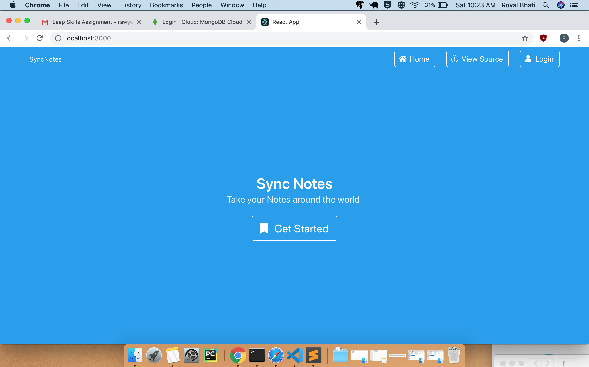
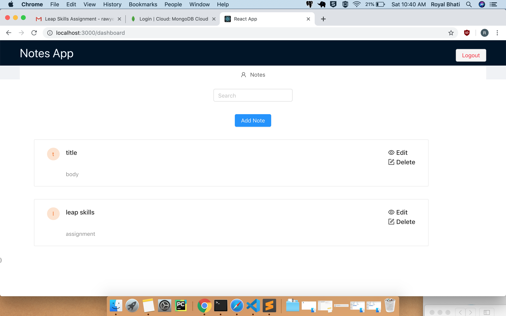

## Notes manager

Store your favorite notes  online. Available everywhere.

## DEMO (hosted on heroku)

https://syncyournotes.herokuapp.com/

## Additional Info while using

1) Since app is hosted on cloud db it,so sometimes you need to refresh the page to view the data.

2) Search functionality requires you to enter the title and press enter to search a note

## Available Scripts

In the project directory,there are two folders:

1) Client :

Containing the frontend

    USe `npm start`

    Runs the app in the development mode. 
    Open [http://localhost:3000](http://localhost:3000) to view it in the browser.

    The page will reload if you make edits. 
    You will also see any lint errors in the console.

1) Server :

Containing the backend

    USe `npm start` to run the backend server

## Screenshots

